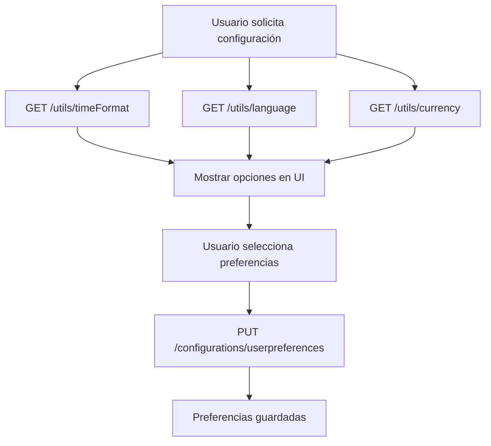

# Sistema de Configuraciones Utilitarias - Documentación Completa

## 📋 Resumen del Sistema Implementado

Este documento describe el sistema completo de configuraciones utilitarias que proporciona opciones predefinidas para `timeFormat`, `language`, y `currency` almacenadas en base de datos y accesibles a través de endpoints REST.

## 🏗️ Arquitectura Implementada

### 1. **Base de Datos**

Se crearon tres nuevas tablas en la base de datos:

#### Tabla `time_formats`
```sql
CREATE TABLE "time_formats" (
    "id" TEXT NOT NULL,
    "value" TEXT NOT NULL UNIQUE,
    "name" TEXT NOT NULL,
    "description" TEXT,
    "isActive" BOOLEAN NOT NULL DEFAULT true,
    "createdAt" TIMESTAMP(3) NOT NULL DEFAULT CURRENT_TIMESTAMP,
    "updatedAt" TIMESTAMP(3) NOT NULL,
    CONSTRAINT "time_formats_pkey" PRIMARY KEY ("id")
);
```

#### Tabla `languages`
```sql
CREATE TABLE "languages" (
    "id" TEXT NOT NULL,
    "code" TEXT NOT NULL UNIQUE,
    "name" TEXT NOT NULL,
    "nativeName" TEXT,
    "country" TEXT,
    "isActive" BOOLEAN NOT NULL DEFAULT true,
    "createdAt" TIMESTAMP(3) NOT NULL DEFAULT CURRENT_TIMESTAMP,
    "updatedAt" TIMESTAMP(3) NOT NULL,
    CONSTRAINT "languages_pkey" PRIMARY KEY ("id")
);
```

#### Tabla `currencies`
```sql
CREATE TABLE "currencies" (
    "id" TEXT NOT NULL,
    "code" TEXT NOT NULL UNIQUE,
    "name" TEXT NOT NULL,
    "symbol" TEXT NOT NULL,
    "country" TEXT NOT NULL,
    "type" TEXT NOT NULL,
    "decimalPlaces" INTEGER NOT NULL DEFAULT 2,
    "isActive" BOOLEAN NOT NULL DEFAULT true,
    "createdAt" TIMESTAMP(3) NOT NULL DEFAULT CURRENT_TIMESTAMP,
    "updatedAt" TIMESTAMP(3) NOT NULL,
    CONSTRAINT "currencies_pkey" PRIMARY KEY ("id")
);
```

### 2. **Estructura de Módulos**

El sistema sigue la arquitectura hexagonal implementada:

```
src/modules/utils/
├── domain/
│   ├── entities/
│   │   ├── time-format.entity.ts
│   │   ├── language.entity.ts
│   │   └── currency.entity.ts
│   └── repositories/
│       ├── time-format.repository.ts
│       ├── time-format.repository.token.ts
│       ├── language.repository.ts
│       ├── language.repository.token.ts
│       ├── currency.repository.ts
│       └── currency.repository.token.ts
├── application/
│   └── use-cases/
│       ├── get-time-formats.use-case.ts
│       ├── get-languages.use-case.ts
│       └── get-currencies.use-case.ts
├── infrastructure/
│   ├── controllers/
│   │   └── utils.controller.ts
│   └── repositories/
│       ├── time-format.repository.impl.ts
│       ├── language.repository.impl.ts
│       └── currency.repository.impl.ts
├── utils.module.ts
└── index.ts
```

## 🚀 Endpoints Disponibles

### 1. **GET /utils/timeFormat**
Obtiene todos los formatos de tiempo disponibles.

**Respuesta:**
```json
{
  "message": "Formatos de tiempo obtenidos exitosamente",
  "timeFormats": [
    {
      "id": "tf1",
      "value": "12h",
      "name": "12 Hours",
      "description": "12-hour format with AM/PM"
    },
    {
      "id": "tf2",
      "value": "24h",
      "name": "24 Hours",
      "description": "24-hour format"
    }
  ],
  "total": 2
}
```

### 2. **GET /utils/language**
Obtiene todos los idiomas disponibles.

**Respuesta:**
```json
{
  "message": "Idiomas obtenidos exitosamente",
  "languages": [
    {
      "id": "lang1",
      "code": "es",
      "name": "Spanish",
      "nativeName": "Español",
      "country": "Colombia"
    },
    {
      "id": "lang2",
      "code": "en",
      "name": "English",
      "nativeName": "English",
      "country": "United States"
    }
  ],
  "total": 4
}
```

### 3. **GET /utils/currency**
Obtiene todas las monedas disponibles con información detallada.

**Respuesta:**
```json
{
  "message": "Monedas obtenidas exitosamente",
  "currencies": [
    {
      "id": "curr1",
      "code": "COP",
      "name": "Colombian Peso",
      "symbol": "$",
      "country": "Colombia",
      "type": "Pesos",
      "decimalPlaces": 0
    },
    {
      "id": "curr2",
      "code": "USD",
      "name": "US Dollar",
      "symbol": "$",
      "country": "United States",
      "type": "Dollars",
      "decimalPlaces": 2
    }
  ],
  "total": 5
}
```

## 📊 Datos Iniciales Cargados

### Time Formats (2 registros)
- **12h**: 12 Hours (12-hour format with AM/PM)
- **24h**: 24 Hours (24-hour format)

### Languages (4 registros)
- **es**: Spanish (Español) - Colombia
- **en**: English (English) - United States
- **pt**: Portuguese (Português) - Brazil
- **fr**: French (Français) - France

### Currencies (5 registros)
- **COP**: Colombian Peso ($) - Colombia - Pesos (0 decimales)
- **USD**: US Dollar ($) - United States - Dollars (2 decimales)
- **EUR**: Euro (€) - European Union - Euros (2 decimales)
- **BRL**: Brazilian Real (R$) - Brazil - Reales (2 decimales)
- **MXN**: Mexican Peso ($) - Mexico - Pesos (2 decimales)

## 💡 Integración con Preferencias de Usuario

Estos endpoints se integran perfectamente con el sistema de preferencias de usuario existente:

### Uso en Frontend
```typescript
// Obtener opciones para dropdowns
const timeFormats = await fetch('/utils/timeFormat').then(r => r.json());
const languages = await fetch('/utils/language').then(r => r.json());
const currencies = await fetch('/utils/currency').then(r => r.json());

// Actualizar preferencias de usuario
await fetch('/configurations/userpreferences', {
  method: 'PUT',
  headers: { 
    'Authorization': `Bearer ${token}`,
    'Content-Type': 'application/json'
  },
  body: JSON.stringify({
    generalPreferences: {
      timeFormat: "24h", // De /utils/timeFormat
      language: "es",    // De /utils/language  
      currency: "COP"    // De /utils/currency
    }
  })
});
```

## 🔧 Características Técnicas

### 1. **Validación y Filtros**
- Solo se devuelven registros activos (`isActive: true`)
- Ordenamiento alfabético por nombre
- Manejo de errores centralizado

### 2. **Extensibilidad**
- Fácil agregar nuevos tipos de configuración
- Estructura modular reutilizable
- Separación clara de responsabilidades

### 3. **Documentación Swagger**
- Endpoints completamente documentados
- Ejemplos de respuesta incluidos
- Esquemas de datos definidos

## 📝 Scripts Útiles

### Seeding Data
```bash
# Poblar datos iniciales
npx ts-node scripts/seed-utils-data.ts
```

### Testing
```bash
# Probar endpoints
node simple-test-utils.js
```

## 🎯 Casos de Uso

### 1. **Configuración de Usuario Nuevo**
Al crear un usuario, se pueden usar estos endpoints para:
- Mostrar opciones de idioma en el registro
- Configurar formato de tiempo por defecto
- Seleccionar moneda local

### 2. **Panel de Configuración**
En el dashboard del usuario:
- Dropdowns poblados desde la base de datos
- Cambios dinámicos sin hardcodear opciones
- Mantenimiento centralizado de opciones

### 3. **Internacionalización**
- Base sólida para i18n
- Configuración por país/región
- Formatos locales automáticos

## 🔄 Flujo de Trabajo Completo



## ✅ Estado del Sistema

- ✅ **Base de datos**: Migraciones aplicadas correctamente
- ✅ **Endpoints**: Todos funcionando y documentados
- ✅ **Datos**: Seeding completado exitosamente
- ✅ **Testing**: Endpoints validados y operativos
- ✅ **Integración**: Módulo registrado en AppModule
- ✅ **Arquitectura**: Clean Architecture implementada

## 🚀 Próximos Pasos Sugeridos

1. **Administración**: Crear endpoints CRUD para administradores
2. **Caché**: Implementar Redis para mejorar performance
3. **Localización**: Agregar traducciones para nombres/descripciones
4. **Validación**: Crear reglas de negocio más complejas
5. **Auditoría**: Tracking de cambios en configuraciones

---

**Fecha de implementación:** 24 de octubre de 2025  
**Versión:** 1.0.0  
**Estado:** ✅ Completado y funcional
